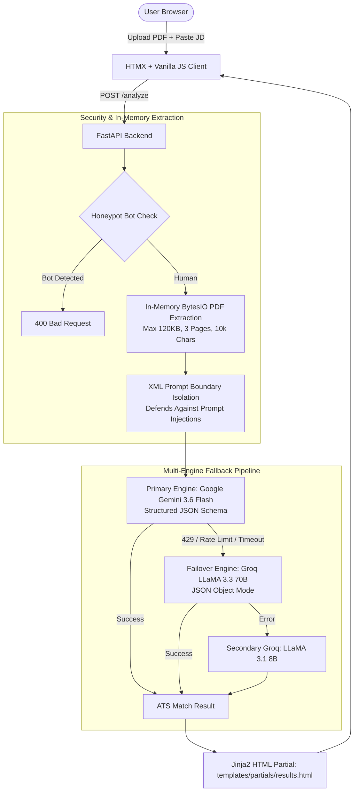

# 🚀 ATS MatchProof — Free ATS Resume & Job Matcher

[](https://www.python.org/)
[](https://fastapi.tiangolo.com/)
[](https://htmx.org/)
[](https://tailwindcss.com/)
[](LICENSE)

A **100% free**, **zero-account**, **privacy-first** ATS (Applicant Tracking System) verification engine. Built with **Python FastAPI**, **HTMX**, and **Tailwind CSS**, featuring an automatic **Multi-Key Dual-AI Failover Architecture** (Google Gemini 3.6 Flash + Groq LLaMA 3.3 70B).

Compare your resume against any job description in seconds: extract skills, identify missing keywords, evaluate experience gaps, and generate high-impact, recruiter-tailored bullet points using the **Google XYZ format**.

---

## 🌟 Key Features & Architecture



### 1. 🔄 Multi-Key Free Tier Failover (100% Cashflow Positive)
- **Primary Engine**: Google GenAI SDK (`gemini-3.6-flash` / `gemini-2.5-flash-lite`) utilizing native structured schema output (`response_schema`).
- **Failover Engine**: Groq SDK (`llama-3.3-70b-versatile` / `llama-3.1-8b-instant`) utilizing JSON schema mode.
- Seamlessly catches rate limits (`429 Resource Exhausted`), outages, or timeouts from Google and routes instantly to Groq with zero downtime.

### 2. 🎯 Recruiter-Grade XYZ Bullet Point Tailoring
- Directs AI to target **Work Experience & Project accomplishment bullets** rather than static skill list sections.
- Employs the **Google XYZ Accomplishment Formula**: *"Accomplished [X], as measured by [Y], by doing [Z]"*.
- Avoids awkward parenthetical qualifiers; outputs professional, metrics-driven bullet points with **1-click clipboard copy**.

### 3. 🔒 Privacy-First & Ephemeral (Zero Disk / Zero Database)
- Uploaded PDFs are parsed strictly in RAM using `io.BytesIO` and discarded immediately upon text extraction.
- No resumes, job descriptions, or personally identifiable information (PII) are stored on disk or in a database.

### 4. 🛡️ Defensive Prompt Injection & Abuse Protection
- **XML Tag Isolation**: Untrusted inputs are wrapped inside `<resume_text>` and `<job_description_text>` tags.
- **Instruction Neutralization**: System instructions strictly command the AI to ignore any adversarial prompts or overrides embedded in uploaded files.
- **Rate Limiting**: Integrated `slowapi` rate limiter (default: 5 requests/minute per IP).
- **Concurrency Throttling**: Global concurrency semaphore prevents burst quota exhaustion.
- **Bot Honeypot Trap**: Invisible field detects and blocks automated scrapers.
- **Security Headers**: Enforces `X-Content-Type-Options: nosniff`, `X-Frame-Options: SAMEORIGIN`, `Referrer-Policy`, and `Permissions-Policy`.

### 5. 💰 Monetization-Ready Responsive Layout
- Modern dark-mode UI with sleek glassmorphism and animated match progress rings.
- Built-in **left and right skyscraper ad rails (160x300)** for desktop viewports.
- Top and in-results sponsored banner placements ready for Google AdSense, Carbon Ads, or affiliate links.

---

## 📏 System Boundaries & Constraints

| Parameter | Limit | Enforcement Mechanism |
| :--- | :--- | :--- |
| **Max PDF File Size** | **120 KB** (122,880 bytes) | Client-side validation + server-side byte check |
| **Max PDF Page Count** | **3 pages** | In-memory `pypdf` page iterator |
| **Max Text Length** | **10,000 characters** (with spaces) | Client counter + server truncation |
| **IP Rate Limit** | **5 requests / minute** | `slowapi` IP bucket limiter |
| **Max Concurrent AI Calls** | **3 requests** | `asyncio.Semaphore` |

---

## 🛠️ Quick Start Guide

### Prerequisites
- Python 3.10 or higher
- Free Google Gemini API Key ([Google AI Studio](https://aistudio.google.com/))
- *(Optional)* Free Groq API Key ([Groq Console](https://console.groq.com/))

### 1. Clone & Set Up Environment

```bash
git clone https://github.com/your-username/atsproof.git
cd atsproof

# Create virtual environment
python3 -m venv .venv
source .venv/bin/activate  # On Windows: .venv\Scripts\activate

# Install dependencies
pip install -r requirements.txt
```

### 2. Configure API Keys

Copy `.env.example` to `.env`:

```bash
cp .env.example .env
```

Edit `.env` with your API keys:

```env
# Primary Engine (Google Gemini Free Tier)
GEMINI_API_KEY=your_gemini_api_key_here

# Fallback Engine (Groq Free Tier)
GROQ_API_KEY=your_groq_api_key_here

# Rate Limiting & Concurrency Configuration
RATE_LIMIT_POLICY=2/minute
MAX_CONCURRENT_REQUESTS=3
```

### 3. Launch Local Server

Using `make`:
```bash
make dev
```
Or directly with `uvicorn`:
```bash
uvicorn main:app --host 127.0.0.1 --port 8001 --reload
```

Open your browser and navigate to:
👉 **`http://127.0.0.1:8001`**

---

## ⚡ Quick Make Commands

| Command | Action |
| :--- | :--- |
| **`make install`** | Set up virtualenv and install dependencies |
| **`make dev`** | Start local dev server with auto-reload (`http://127.0.0.1:8001`) |
| **`make test`** | Run automated test suite with `pytest` |
| **`make stop`** | Terminate all running local uvicorn instances |
| **`make clean`** | Clear cache, `.pyc`, and temporary test artifacts |
| **`make docker-build`** | Build production Docker image |
| **`make docker-run`** | Run containerized app on port 8000 |

---

## 🧪 Running Automated Tests

Run the comprehensive test suite covering input validation, boundaries, security headers, honeypot traps, and rate limits:

```bash
python -m unittest discover -s src/test -p "test_*.py" -v
```

Or using `pytest`:

```bash
pytest src/test/ -v
```

---

## 📁 Repository Structure

```
atsproof/
├── .env.example               # Configuration and API key template
├── .gitignore                 # Git ignore rules for virtualenvs and secrets
├── README.md                  # Project documentation
├── requirements.txt           # Minimal Python dependencies
├── main.py                    # Root entrypoint re-exporting app
├── templates/                 # Jinja2 templates (index.html, partials/)
│   ├── index.html             # Single-page frontend (Tailwind + HTMX + Ad Slots)
│   └── partials/
│       ├── results.html       # Results view (Match score ring, keywords, XYZ bullets)
│       ├── error.html         # User-friendly error alert partial
│       └── rate_limit.html    # 429 Too Many Requests partial
└── src/                       # Modular source package
    ├── __init__.py            # Package initialization
    ├── app.py                 # FastAPI application factory
    ├── config.py              # Centralized settings & bounds
    ├── engine.py              # AI inference & multi-key failover
    ├── extractor.py           # In-memory PDF text extraction
    ├── middleware.py          # Security headers & rate limit handler
    ├── prompts.py             # System prompts & prompt defense
    ├── routes.py              # APIRouter route definitions
    ├── schemas.py             # Pydantic output schemas
    └── test/                  # Test suite
        ├── __init__.py
        └── test_app.py        # 9 automated unit & integration tests
```

---

## 🚢 Production Deployment (Nginx + FastAPI on Port 80)

The application includes a unified Docker setup that runs **Nginx reverse proxy** and **Uvicorn/FastAPI** inside the **same container**, exposing port 80 directly with gzip compression and client rate header forwarding.

### Quick Start with Docker Compose

```bash
# Build and launch on port 80
make compose-up

# View live container logs
make compose-logs

# Stop deployment
make compose-down
```

Or using `docker compose` directly:

```bash
docker compose up -d --build
```

### Standalone Docker Deployment

```bash
# Build the unified image
make docker-build

# Run container on port 80 with .env configuration
make docker-run
```

Visit:
👉 **`http://localhost`** (Port 80)

---

## 📄 License

Distributed under the **MIT License**.
